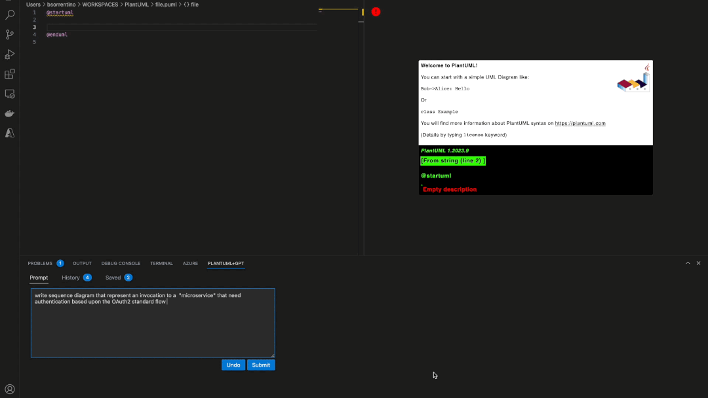
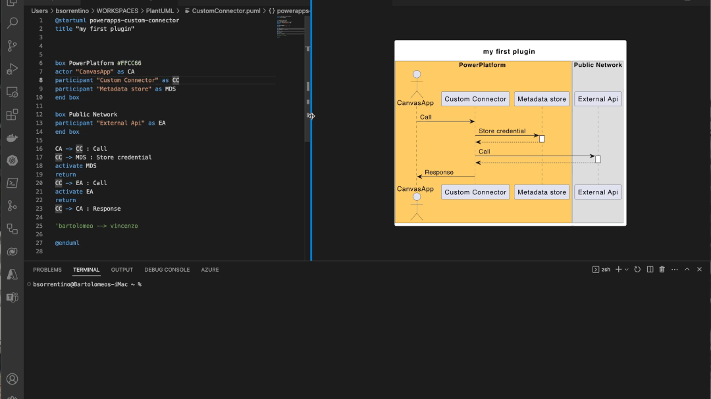

# vscode-plantuml-gpt

vscode extension that allows to create/update PlantUML diagram using GPT. Thought to work jointly with [PlantUML extension]

## Features

* Show GPT panel when a plantuml editor is activated.
* Uses current diagram as input context for GPT processing, this allows to perform intelligent update
* Keeps track of submitted prompts with possibility to persist them

### Create a diagram using NLP

Describe best as you can the diagram that you'd like to create and GPT will generate it. In the video below you can see the generated diagram using prompt:

>```
>Write sequence diagram that represent an invocation to a "microservice" that need authentication based upon the OAuth2 standard flow 
>```



### Update a diagram using NLP

You can also give to GPT an instruction to update current diagram



## Requirements

1. Need to have an extension able to define a PlantUML editor (ie. define `plantuml` document type). Take a look to [PlantUML extension]

## Extension Settings

You need to configure an [OpenAI] token to enable extension

<!--
For example:

This extension contributes the following settings:

* `myExtension.enable`: Enable/disable this extension.
* `myExtension.thing`: Set to `blah` to do something.
-->

<!--

## Known Issues

Calling out known issues can help limit users opening duplicate issues against your extension.
-->

<!--

## Release Notes

-->

---

[PlantUML extension]: https://marketplace.visualstudio.com/items?itemName=jebbs.plantuml
[OpenAI]: https://openai.com